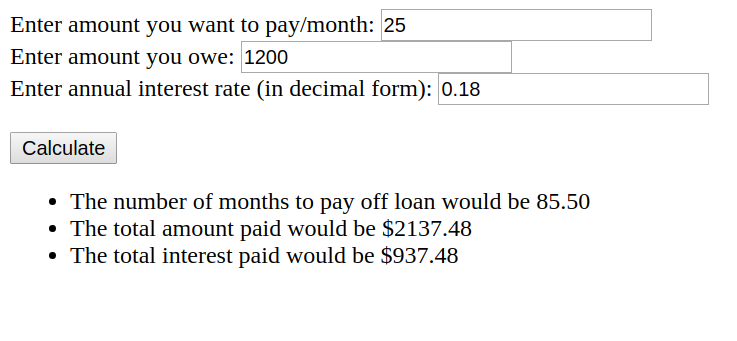
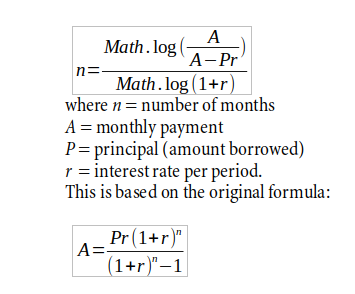

# Payoff Projector for Loan (Loan Calculator)

## The idea

Everyone takes out a loan at some point in their lives. Credit cards, in a sense, function like loans - where the amount that isn't paid off accrues interest. It would be best to pay off the credit card in its entirety - but we know that is not always doable and sometimes we pay just the minimum amount. But how much interest would that accumulate over time? And what is a reasonable monthly payment to avoid accumulating a large interest? This program is built for ICS314 and uses JavaScript to help answer these questions.

## The program
You can find the code to this program in my Projects folder or run it yourself in [JFiddle](https://jsfiddle.net/butterfreeDay/fLhv640k/)

## The math

The math behind the getMonths() function is based on the following:

