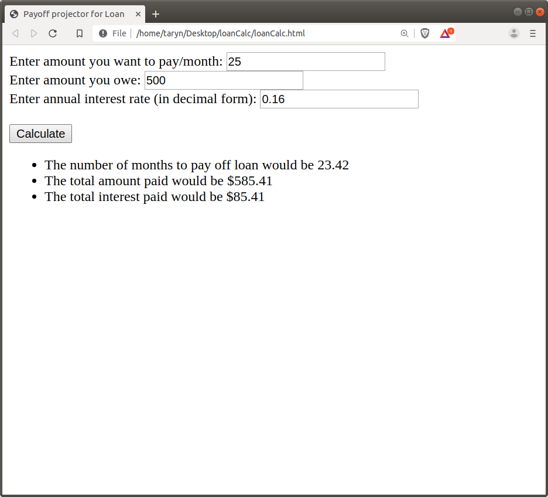

# Payoff Projector for Loan (Loan Calculator)

## The idea

Everyone takes out a loan at some point in their lives. Credit cards, in a sense, function like loans - where the amount that isn't paid off accrues interest. It would be best to pay off the credit card in its entirety - but we know that is not always doable and sometimes we pay just the minimum amount. But how much interest would that accumulate over time? And what is a reasonable monthly payment to avoid accumulating a large interest? This program is built for ICS314 and uses JavaScript to help answer these questions.<br>

<p></p>
Figure 1 - Loan Calculator showing sample input.

## The math

The math behind the getMonths() function is based on the following:


## The program
You can find the code to this program in my [Projects - loanCalculator](https://github.com/microtaryn/microtaryn.github.io/tree/master/projects/loanCalculator) folder or run it yourself in [JFiddle](https://jsfiddle.net/butterfreeDay/fLhv640k/)

<p>We can breakdown the code as follows. The <b>init()</b> function links the clicking of the button with an id="calculate" to the calling of the <b>calcMonths()</b> function. </p>

```js
function init() {
                const calculate = document.getElementById("calculate");
                calculate.addEventListener('click',calcMonths);
            }
```

The <b>calcMonths()</b> function will take the values entered by the user for 1) the amount per month, 2) the total amount originally borrowed and 3) the annual interest rate. It calls the <b>getMonths()</b> function to perform the calculation involving the quotient of logs (illustrated in the math section. If the <b>getMonths()</b> function returns <b>NaN</b> or not a number, this means that the payment per month is so small that it would take forever to pay off the loan. This message is displayed to the user. Otherwise, if months is a valid number, several sentences displaying the 1) number of months, 2) the total amount paid and 3) the total interest paid are shown on the screen.

```js
function calcMonths(){
                //console.log("calcMonths() called");
                const amountBox = document.getElementById("amount");
                const borrowedBox = document.getElementById("borrowed");
                const rateBox = document.getElementById("rate");
                const answers = document.getElementById("answers");
                removeChildren(answers);
                let amount = Number(amountBox.value);
                let borrowed = Number(borrowedBox.value);
                let rate = Number(rateBox.value);
                //console.log(getMonths(amount,borrowed,rate));
                let months = getMonths(amount,borrowed,rate);
                // will return NaN if months is an infinite value
                if (isNaN(months) === true) {
                    //console.log("Your monthly payment is too small.");
                    let li = document.createElement("li");
                    let msg = "That loan payment is so small, it would take forever to pay off the loan";
                    li.appendChild(document.createTextNode(msg));
                    answers.appendChild(li);
                }
                //months will be a valid number
                else {
                    let li= document.createElement("li");
                    let msg = "The number of months to pay off loan would be " + months.toFixed(2);
                    li.appendChild(document.createTextNode(msg));
                    answers.appendChild(li);
                    let total = months * amount;
                    msg = "The total amount paid would be $" + total.toFixed(2);
                    li= document.createElement("li");
                    li.appendChild(document.createTextNode(msg));
                    answers.appendChild(li);
                    let interest = total - borrowed;
                    msg = "The total interest paid would be $" + interest.toFixed(2);
                    li= document.createElement("li");
                    li.appendChild(document.createTextNode(msg));
                    answers.appendChild(li);   
                }
            }
```
## Conclusion
This project was an exercise in demonstrating to people why it is important to pay off more than just the minimum payment on a credit card. This is because the interest rate for credit cards is so high. Users of my program can see 1) how long it would take to pay off a large balance and 2) the large amount of interest that they would have to pay. Hopefully, they also see that they should not allow their credit card balance to get high.
