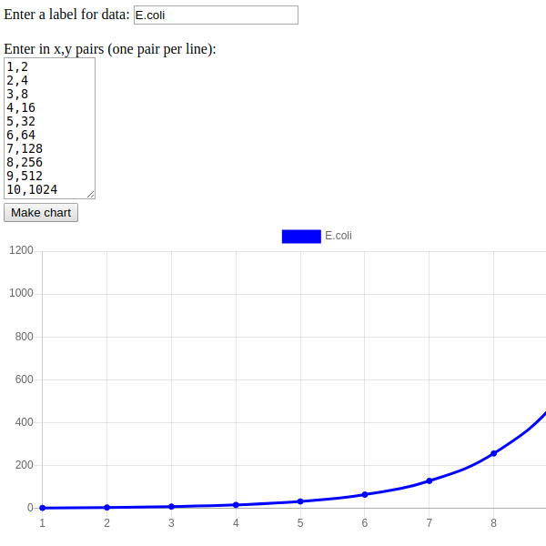

# XY Plotter

## The idea
Chart.js is an open-source JavaScript library that makes it easy to produce charts on a webpage.
With my interface, the user can simply enter in ten XY pairs and click on "Make chart" to make a nice scatter plot.
This makes it easy for someone to utilize Chart.js scatter plot features without having to figure out how Chart.js functions work.
This is my second project for ICS314 and my first attempt using Chart.js

## The program
You can find the code to this program in my [Projects - XYPlotter](https://github.com/microtaryn/microtaryn.github.io/tree/master/projects/XYPlotter) folder or run it yourself in [JFiddle](https://jsfiddle.net/butterfreeDay/01tzvw2L/)

