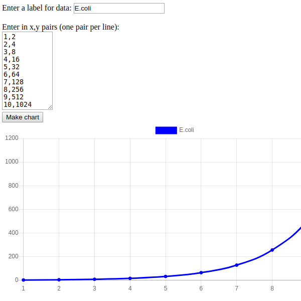
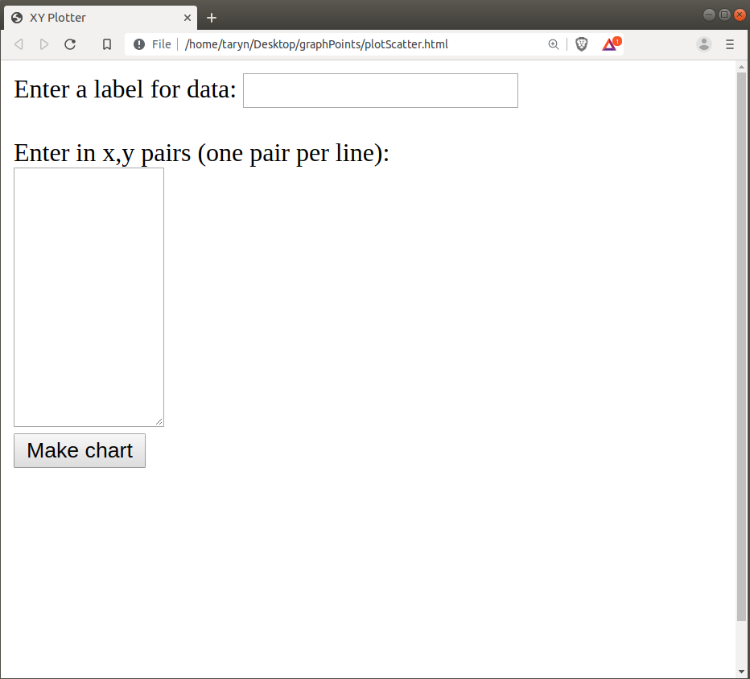
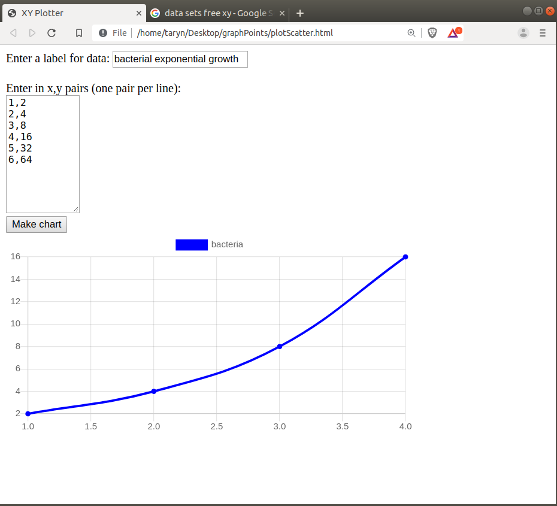
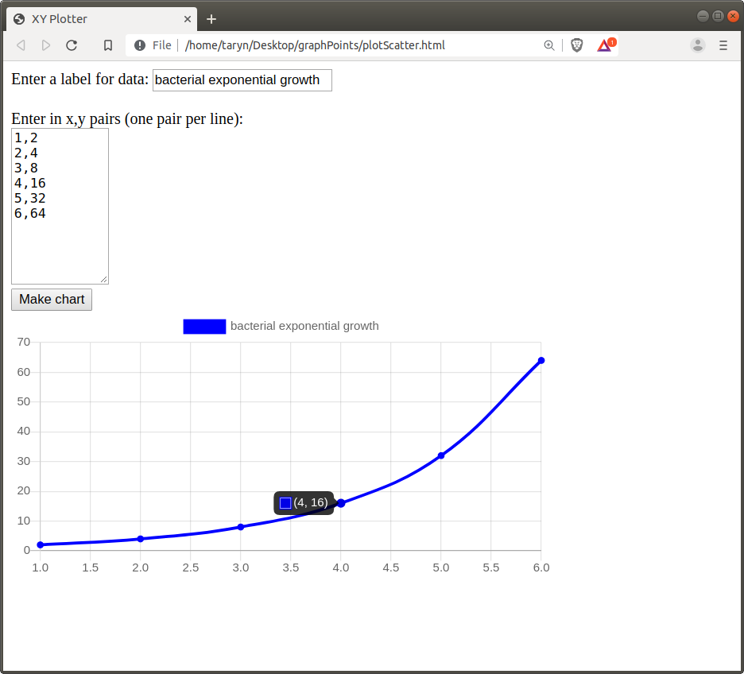

# XY Plotter
This is my second project for ICS314 and my first attempt using Chart.js
## The idea
[Chart.js](https://www.chartjs.org/) is an open-source JavaScript library that makes it easy to produce charts on a webpage. To implement Chart.js however, requires that the user understand 1) HTML (to build the frame of their webpage) and 2) understand JavaScript (to implement Chart.js functions).
For my project, XY Plotter, I decided to simplify the learning curve of Chart.js and created a webpage that allows users to build Chart.js scatter plots. I chose the scatter plot features of Chart.js because scatter plots are commonly used to demonstrate relationships between two variables, X and Y. For more information on scatter plots, here is a nice summary put together by ChartIO Data Tutorials : [A Complete Guide to Scatter Plots.](https://chartio.com/learn/charts/what-is-a-scatter-plot/)

With my webpage interface, a user can simply enter in XY pairs and click on "Make chart" to make a nice scatter plot. The user also has the option of labelling their data. Here is a screenshot of XY Plotter (sans data) (See Figure 1).

<figcaption>Figure 1 - XY Plotter. Users must fill out text areas to generate a label and to enter in their data.</figcaption>

 Here is a screenshot of XY Plotter with some data points. Note that users must enter each data point with X and Y values separated by a comma (e.g. X,Y). (See Figure 2).

<figcaption>Figure 2 - XY Plotter with example data. Bacteria have an exponential growth phase represented by the mathematical formula, n x 2^g. Thus, each bacterial cell is capable of generating 2 daughter cells asexually via binary fission. </figcaption>
For more information on bacterial growth, see [Todar's: Growth of Bacterial Populations](http://textbookofbacteriology.net/growth_3.html)

 The default setting for Chart.js scatter plots is for onHover() to be on. This gives the scatter plot more interactivity with the user and this feature can be useful in demonstrations (i.e. when pointing out a specific data point) (See Figure 3).

<figcaption>Figure 3 - XY Plotter showing onHover() over a data point.
 
 
 Programmers can also download my code (See links to code below) and use XY Plotter as a base webpage, adding additional Chart.js features (e.g. X and Y labels). In this way, XY Plotter can be a starting point for building more complex graphing interfaces fitting user-specific needs. 

<h3>The program</h3>

You can find the code to this program in my [Projects - XYPlotter](https://github.com/microtaryn/microtaryn.github.io/tree/master/projects/XYPlotter) folder or run it yourself in [JFiddle](https://jsfiddle.net/butterfreeDay/01tzvw2L/)

